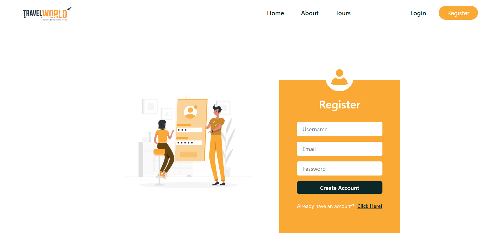

# MERN Stack Tours Booking Website - Travel Story

A **Full-Stack MERN Application** built from scratch to streamline **tour booking** with modern API integration, custom hooks, and a sleek user interface. This project covers **both frontend and backend development** using the **MERN stack (MongoDB, Express, React, Node)**.

---

## Project Overview

In this practical project, I am building a **Tours Booking Website** from scratch, covering both **frontend and backend development** using the **MERN stack**. The project aims to deliver a robust booking platform with secure authentication, smooth data fetching, and a visually appealing user interface.

### Key Components:
- **Backend (Node.js & Express)**: RESTful API to manage tours, users, reviews, and bookings.
- **Database (MongoDB)**: NoSQL database for storing tours and user data.
- **Frontend (React.js)**: Modern UI built with React, integrating API calls using **Context API** and **Custom Hooks**.
- **Payment Integration**: *(Upcoming)* Stripe/Razorpay for booking payments.
- **User Authentication**: Secure **JWT-based login and registration** system.
- **Modern UI/UX**: Built with **Reactstrap, CSS, and responsive design principles** for a smooth user experience.

---

## Key Features

**Full-Stack MERN App** – Backend REST API + Frontend React UI  
**API Integration** – Fetching data using **Custom Hook** and **Context API**  
**User Authentication** – Secure **JWT login/signup**  
**Dynamic Tours Listing** – Search tours by **city, distance, group size**  
**Featured Tours** – Display **popular/featured tours**  
**Reviews & Ratings** – Users can **leave reviews and ratings**  
**Responsive Design** – Fully **mobile-friendly modern interface**  
**Error Handling & Loading State** – With **React Hooks and Context**  
**Modular Code Structure** – **Reusable components, custom hooks, and context provider**

---

## Screenshots

### Homepage

### Tours Page

### Login and Register Page

---

## Tech Stack

| Technology    | Description                                  |
|---------------|----------------------------------------------|
| **MongoDB**   | NoSQL database for data storage               |
| **Express.js**| Backend framework for REST API                |
| **React.js**  | Frontend library for building user interface  |
| **Node.js**   | JavaScript runtime environment                |
| **Context API** | State management across components          |
| **Custom Hooks** | Abstracted logic for API data fetching     |
| **Reactstrap**| React components for Bootstrap UI             |
| **JWT**       | Secure authentication                        |

---

## 📂 Folder Structure (Ongoing)

